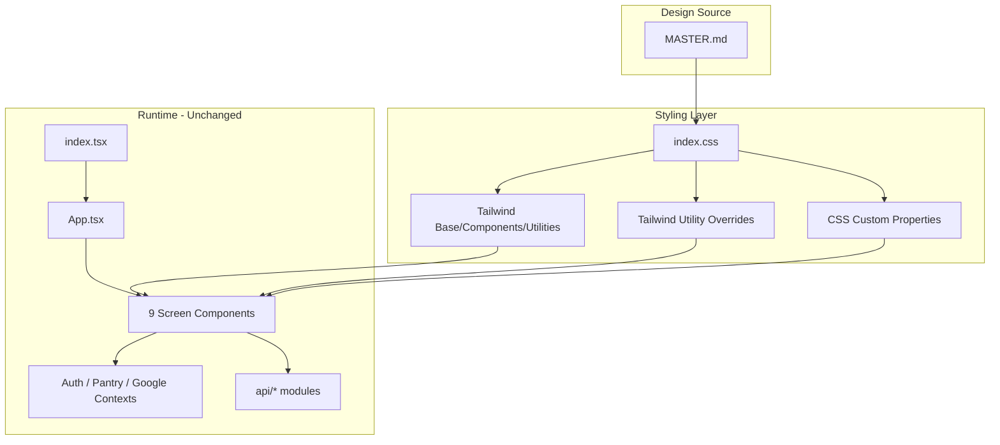
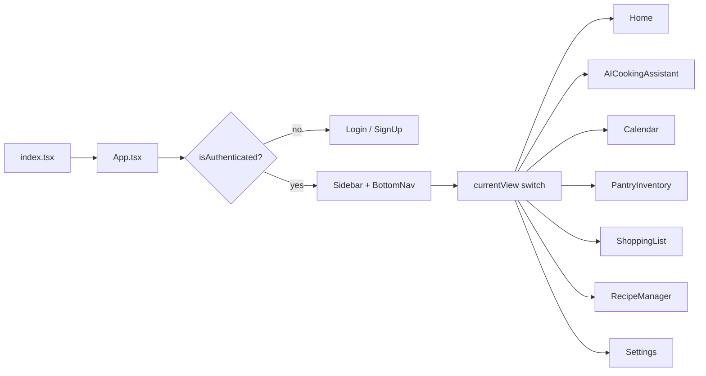

# Technical Design: Design System Visual Alignment

**Feature reference:** [design-system-visual-alignment.md](../features/design-system-visual-alignment.md)  
**Design system source:** [MASTER.md](../../client/design-system/lardermind/MASTER.md)  
**Status:** Design  
**Scope:** Frontend (Vite + React + Tailwind CSS)

---

## 1. Overview

This design aligns the LarderMind web frontend with the dark analytics palette and typography defined in `client/design-system/lardermind/MASTER.md`. The implementation is **CSS-only**: global design tokens, Tailwind utility remapping, and accessibility defaults live in a single stylesheet. Component logic, routing, API calls, hooks, and contexts are unchanged except for one anti-pattern fix in `AICookingAssistant`.

### Goals

| Goal | How achieved |
|------|--------------|
| **Low coupling** | Styling is isolated to `index.css`; components keep existing Tailwind class names; no shared theme context or per-component refactors required. |
| **Testable** | Visual changes are deterministic CSS output; functional tests require no updates; a11y and visual regression tests validate palette and focus behavior. |
| **Rollbackable** | Revert two files (`index.css`, one line in `AICookingAssistant.tsx`); no DB migration, API version, or feature flag. |
| **No regressions** | No changes to auth flow, navigation state, data-fetching, or business logic; only computed styles change at render time. |

### Non-goals (this iteration)

- Per-page design overrides via `design-system/pages/[page-name].md`
- Tailwind `theme.extend` token migration
- Light-mode theme toggle
- Component-level design system primitives (shared `Button`, `Card`, `Input` components)
- Mobile app styling (separate codebase)

### Files changed

| File | Change |
|------|--------|
| [`client/src/index.css`](../../client/src/index.css) | Design tokens, font import, element defaults, utility remapping, motion/focus rules |
| [`client/src/components/AICookingAssistant.tsx`](../../client/src/components/AICookingAssistant.tsx) | Remove emoji from recipe card title (anti-pattern compliance) |

---

## 2. Architecture

### 2.1 Current state (before alignment)

```
MASTER.md (design spec, not wired to runtime)
  └─► Components use raw Tailwind utilities (bg-white, text-gray-*, etc.)
        └─► Default Tailwind palette (light grays, semantic reds/blues/greens)
              └─► Inconsistent with MASTER dark analytics intent
```

- `tailwind.config.js` contains only `content` paths — no theme extensions.
- Theming was implicit via per-component Tailwind classes with light-mode semantics.
- Fonts: system defaults (no Fira Code / Fira Sans).

### 2.2 Target state (after alignment)

```
MASTER.md (source of truth)
  └─► index.css
        ├── @import Google Fonts (Fira Code, Fira Sans)
        ├── :root { --color-*, --space-*, --shadow-* }
        ├── Element defaults (body, h1–h6, input, button, focus-visible)
        └── Global utility overrides (.bg-white, .text-gray-*, etc.)
              └─► Components (unchanged class names)
                    └─► Resolve to MASTER dark palette at paint time
```

### 2.3 Component diagram



### 2.4 Key design decisions

| Decision | Rationale | Trade-off |
|----------|-----------|-----------|
| CSS variables in `:root` | Single source for palette values; easy to audit against MASTER.md | Variables are not consumed by Tailwind JIT unless referenced in CSS |
| Global utility remapping with `!important` | Achieves app-wide palette swap without editing 17 component files | Future components using remapped classes inherit overrides; local exceptions need inline styles or unmapped classes |
| No `tailwind.config.js` theme extension | Keeps config minimal; token changes do not require rebuild of Tailwind theme | Cannot use `bg-primary` semantic classes without future config work |
| Font `@import` at top of `index.css` | One load point, loads before component paint | Adds external CDN dependency; slight FCP impact on cold load |
| Element-level defaults for inputs/buttons | Covers form controls without per-component changes | May affect third-party embeds that rely on native input styling |

### 2.5 Token mapping

| MASTER role | CSS variable | Hex | Applied via |
|-------------|--------------|-----|-------------|
| Primary | `--color-primary` | `#0F172A` | `.bg-white` remap, gradient stops |
| Secondary | `--color-secondary` | `#1E293B` | `.bg-gray-50/100`, inputs, gradients |
| CTA/Accent | `--color-cta` | `#22C55E` | Semantic color remaps, focus ring |
| Background | `--color-background` | `#020617` | `body` background, overlay tints |
| Text | `--color-text` | `#F8FAFC` | `body` color, `.text-gray-*` remap |

Spacing (`--space-xs` through `--space-3xl`) and shadow (`--shadow-sm` through `--shadow-xl`) tokens are defined for future use; current alignment relies primarily on existing component padding/margin classes.

---

## 3. API Flow

**No backend or application API changes.**

### 3.1 External dependency: Google Fonts CDN

The only new network interaction is font loading triggered at CSS parse time:

```
Browser loads index.css
  └─► GET fonts.googleapis.com/css2?family=Fira+Code&family=Fira+Sans
        └─► Returns @font-face rules pointing to fonts.gstatic.com
              └─► Browser downloads .woff2 files
                    └─► Fonts applied to body (Fira Sans) and h1–h6 (Fira Code)
```

| Aspect | Detail |
|--------|--------|
| Authentication | None |
| User data transmitted | None (standard Google Fonts referrer) |
| Failure mode | Browser falls back to `sans-serif` / `monospace` system fonts |
| Caching | Fonts cached by browser after first load |

### 3.2 Unchanged application API surface

All existing `client/src/api/*` modules (`chat.ts`, `recipes.ts`, `pantryItem.ts`, `shoppingList.ts`, `mealPlan.ts`, `api-auth.ts`, etc.) are untouched. Vite dev proxy (`/api`, `/auth` → `localhost:8080`) is unchanged.

---

## 4. DB Changes

**None.**

This feature does not read from or write to any database. `localStorage` usage in `AICookingAssistant` (saved recipes) is unchanged.

---

## 5. UI Flow

### 5.1 Application navigation (unchanged)

Navigation remains state-based in `App.tsx` via `currentView` string — not URL routing.



Props, event handlers, and view-switching logic are identical before and after alignment. Only computed CSS output differs.

### 5.2 Styling application flow

```
Component renders with existing Tailwind classes (e.g. bg-white text-gray-800)
  └─► Tailwind generates utility rules
        └─► index.css global overrides match class selectors
              └─► !important rules replace color/background/border values
                    └─► Browser paints MASTER palette
```

### 5.3 Visual delta per screen

| View | Component | Visual change |
|------|-----------|---------------|
| `login` / `signup` | `Login.tsx`, `SignUp.tsx` | Light backgrounds → dark primary; form inputs → dark secondary with slate borders |
| `home` | `Home.tsx` | Cards and KPI tiles → dark secondary palette; accent badges → CTA green |
| `aiAssistant` | `AICookingAssistant.tsx` | Chat cards, saved recipes, overlays → dark theme; recipe title emoji removed |
| `calendar` | `Calendar.tsx` | Calendar grid, event badges → remapped semantic colors |
| `pantryInventory` | `PantryInventory.tsx` | List rows, action buttons → dark palette |
| `shoppingList` | `ShoppingList.tsx` | Checklist items, category badges → CTA green accents |
| `recipeManager` | `RecipeManager.tsx`, `RecipeCard.tsx`, `RecipeDetail.tsx` | Recipe cards, detail panels → dark cards with green accents |
| `settings` | `Settings.tsx` | Form controls → dark input styling |
| All authenticated views | `Sidebar.tsx`, `BottomNav.tsx` | Navigation chrome → dark secondary |

### 5.4 Accessibility enhancements

| Rule | Implementation |
|------|----------------|
| Visible focus | `*:focus-visible { outline: 2px solid var(--color-cta); outline-offset: 2px; }` |
| Pointer affordance | `button, a, [role="button"] { cursor: pointer; }` |
| Smooth transitions | `button, input, textarea, select { transition: all 200ms ease; }` |
| Reduced motion | `@media (prefers-reduced-motion: reduce)` collapses all transitions/animations to 0.01ms |

### 5.5 Intentionally unchanged visuals

- Embedded SVG brand colors (e.g. Google sign-in icon fills)
- Component layout structure, spacing classes, and responsive breakpoints
- Lucide icon set usage (no emoji-as-icon)

---

## 6. State Management

**No changes.**

| Module | Role | Status |
|--------|------|--------|
| `contexts/authContext.tsx` | Authentication state, token handling | Unchanged |
| `contexts/pantryContext.tsx` | Pantry inventory state | Unchanged |
| `contexts/googleClientContext.tsx` | Google OAuth client | Unchanged |
| `hooks/useSearchIngredient.tsx` | Ingredient search | Unchanged |
| `App.tsx` `currentView` | View navigation state | Unchanged |
| `AICookingAssistant` local state | Chat messages, saved recipes, sub-views | Unchanged (display text only) |

Styling is purely presentational and does not introduce React context, reducers, or side effects.

---

## 7. Error Handling

| Failure scenario | Detection | Behavior | User impact |
|------------------|-----------|----------|-------------|
| Google Fonts CDN unreachable | Network error on `@import` | Browser uses system font fallbacks (`sans-serif`, `monospace`) | Layout intact; typography differs temporarily |
| CSS variable undefined | DevTools inspection | Browser uses `initial` for that property | Isolated visual glitch; no JS exception |
| Utility remap collision | Visual QA on new component | Remapped class resolves to MASTER palette instead of intended Tailwind color | Requires local override (inline style or unmapped class) |
| `prefers-reduced-motion` active | OS accessibility setting | Media query zeroes transition/animation duration | No animation; fully functional |
| Third-party embed with Tailwind classes | Integration testing | Global remap may alter embed appearance | Per-embed CSS scoping if needed (future) |
| Modal/toast readability | Manual QA | Dark overlay on dark content may reduce contrast | Per-screen overlay opacity adjustment (future) |

No new error boundaries, toast messages, or retry logic are required — all failure modes degrade visually without breaking functionality.

---

## 8. Security

| Area | Assessment |
|------|------------|
| Authentication / authorization | No changes to token flow, login, or route guards |
| API payloads | No changes to request/response shapes or endpoints |
| Storage | No changes to `localStorage`, cookies, or session handling |
| XSS surface | No new `dangerouslySetInnerHTML` usage; pre-existing instances unchanged and out of scope |
| Secrets / config | No environment variable or `.env` changes |
| External CDN | Google Fonts loads CSS and font files from Google domains |

### CSP considerations

If a `Content-Security-Policy` header is enforced (e.g. Azure Static Web Apps), allow:

```
style-src: https://fonts.googleapis.com
font-src:  https://fonts.gstatic.com
```

Without these directives, fonts fall back to system defaults — functional but off-brand.

---

## 9. Rollback Plan

This change is fully contained and reversible without data migration.

### Step 1: Revert `client/src/index.css`

Remove:
- Google Fonts `@import`
- `:root` token block
- Element-level defaults (body, headings, inputs, focus, reduced-motion)
- All global utility remapping rules (`.bg-white`, `.text-gray-*`, etc.)

Result: Tailwind default light palette restored.

### Step 2: Revert `AICookingAssistant.tsx`

Restore emoji in recipe card title if anti-pattern fix is rolled back.

### Verification after rollback

- Run existing test suite (should pass in both directions)
- Spot-check Login, Home, and AI Assistant screens for expected light palette

No feature flag, API version bump, or cache invalidation required.

---

## 10. Test Strategy

### 10.1 Regression guard

All existing unit and integration tests should pass **without modification**. This feature adds no logic branches. If a test asserts on computed color values, update expected values to MASTER palette equivalents.

### 10.2 Automated tests (recommended)

| Test type | Tool | Scope | Assertion |
|-----------|------|-------|-----------|
| Accessibility | `jest-axe` or Playwright + `@axe-core/playwright` | Login, Home, AICookingAssistant | No contrast failures; focus indicators present |
| Visual regression | Playwright screenshot diff or Chromatic | All 9 views at 375, 768, 1024, 1440 px | Pixel diff against MASTER-approved baselines |
| Anti-pattern lint | Custom ESLint rule or CI script | All `client/src/components/*.tsx` | No emoji characters in JSX text nodes used as icons |

Example Playwright viewport matrix:

```typescript
const viewports = [
  { width: 375, height: 812 },   // mobile
  { width: 768, height: 1024 },  // tablet
  { width: 1024, height: 768 },  // desktop
  { width: 1440, height: 900 }, // wide desktop
];
```

### 10.3 Manual verification checklist

Maps to the feature doc verification checklist:

- [ ] Auth screens submit and navigate exactly as before
- [ ] Navigation state and page switching unchanged on desktop and mobile
- [ ] Pantry, shopping list, calendar, recipe manager, and AI assistant data operations unchanged
- [ ] Focus ring visible with keyboard Tab navigation
- [ ] No emojis used as icons in UI
- [ ] Responsive layout at 375, 768, 1024, 1440 widths — no horizontal overflow
- [ ] `prefers-reduced-motion` enabled → no visible transitions
- [ ] Google Fonts throttled/offline → app remains functional with fallback fonts
- [ ] Muted helper text (`text-gray-500`) meets 4.5:1 contrast on dark backgrounds

### 10.4 Edge case test matrix

| Edge case | Test method | Expected result |
|-----------|-------------|-----------------|
| Class collision on new component | Add component with `bg-white` | Renders as `--color-primary`, not white |
| Modal overlay readability | Open modals on dark screens | Content readable; adjust opacity if not |
| SVG brand icons | Google sign-in on Login | Original brand colors preserved |
| Hover states | Hover buttons/links | 200ms transition; `--color-cta` tint on semantic hovers |
| Mobile overflow | 375px width scroll test | No horizontal scrollbar |

---

## 11. Performance Considerations

| Factor | Impact | Mitigation |
|--------|--------|------------|
| CSS-only change | No extra render loops or JS overhead | N/A |
| Google Fonts (2 families, multiple weights) | Slight FCP increase on cold load | `display=swap` in import URL; browser caching |
| Global `transition: all 200ms` on inputs/buttons | Minimal GPU cost | `prefers-reduced-motion` override |
| `!important` utility overrides | No runtime cost beyond normal CSS cascade | N/A |

No bundle size increase — no new JavaScript dependencies.

---

## 12. Future Work (out of scope)

- Migrate Tailwind config to `theme.extend` with semantic tokens (`bg-primary`, `text-cta`)
- Extract shared UI primitives (`Button`, `Card`, `Input`, `Modal`) referencing CSS variables
- Add per-page overrides via `design-system/pages/[page-name].md`
- Self-host fonts to eliminate Google CDN dependency
- Light/dark theme toggle with user preference persistence
